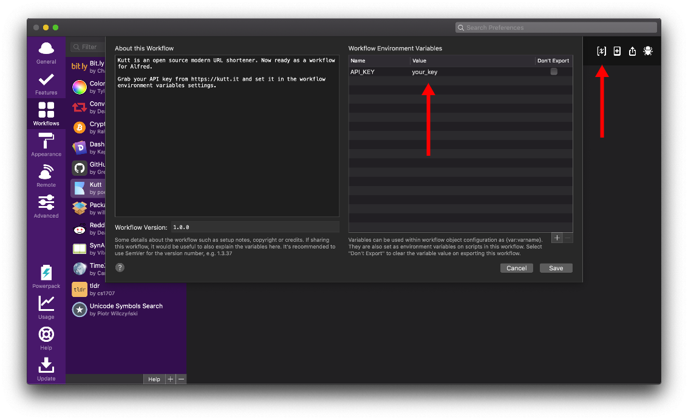

# Alfred workflow for Kutt
[Kutt](https://kutt.it) is a modern open source URL shortener. With this workflow, you can kutt your links shorter right from your Alfred app.

**[Download](https://github.com/thedevs-network/alfred-kutt/releases/download/1.0.0/kutt.alfredworkflow)**


## Requirements
- [Alfred app](https://www.alfredapp.com)
- [Alfred powerpack](https://www.alfredapp.com/powerpack/)
- [Node.js](https://nodejs.org/)

## Setup
Login to [Kutt](https://kutt.it), go to settings and generate an API key.
Open `Alfred prefrences > Workflows > Kutt` and add the API key in workflow's environment variables settings.



## Commands
```
kutt {url}
```